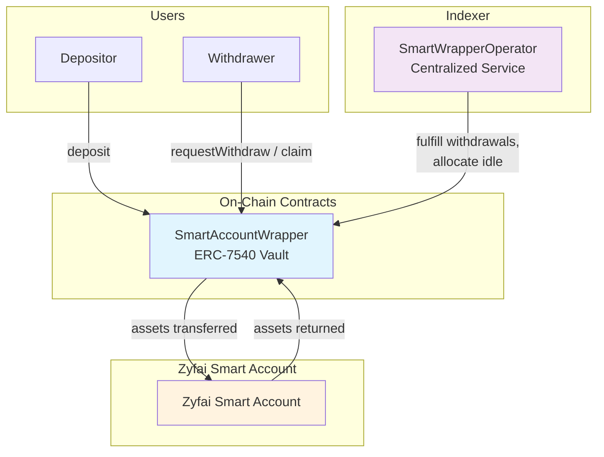
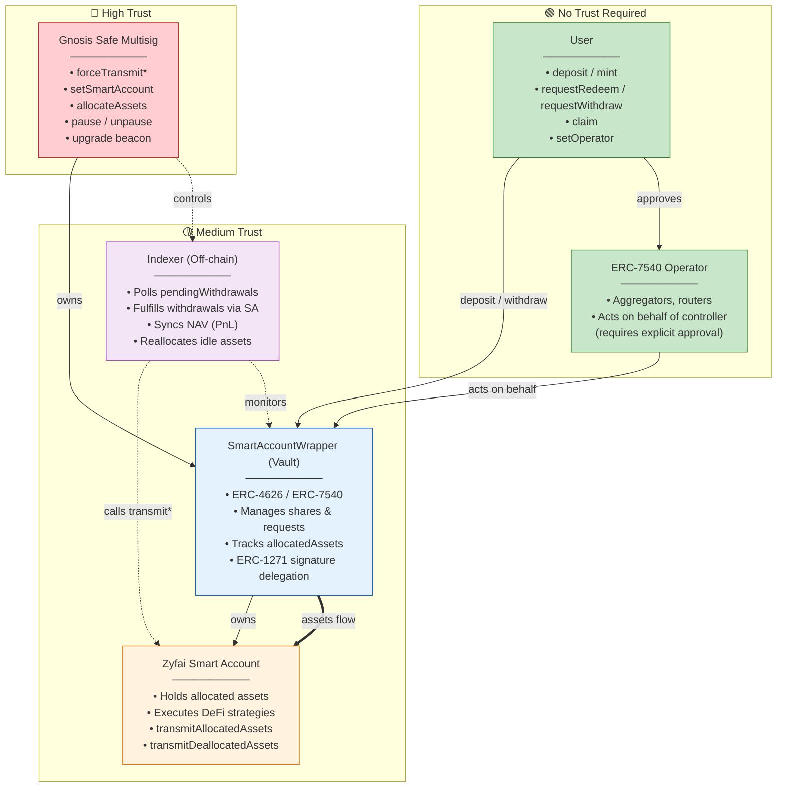
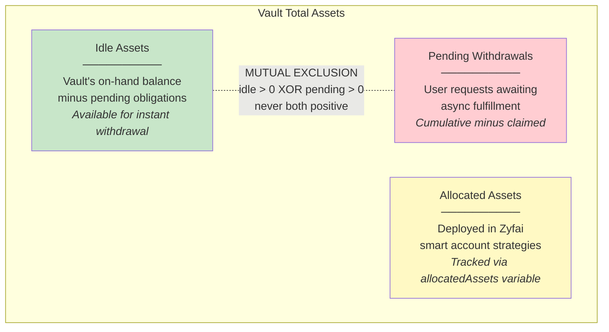
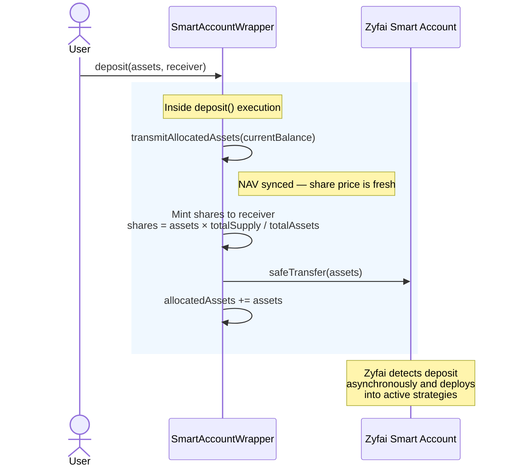
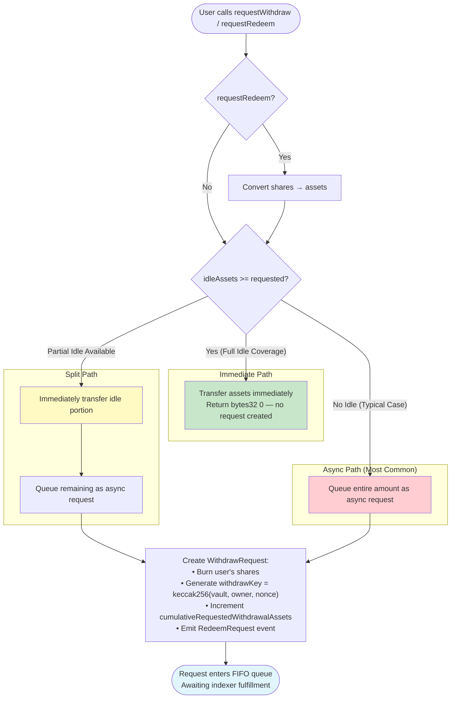
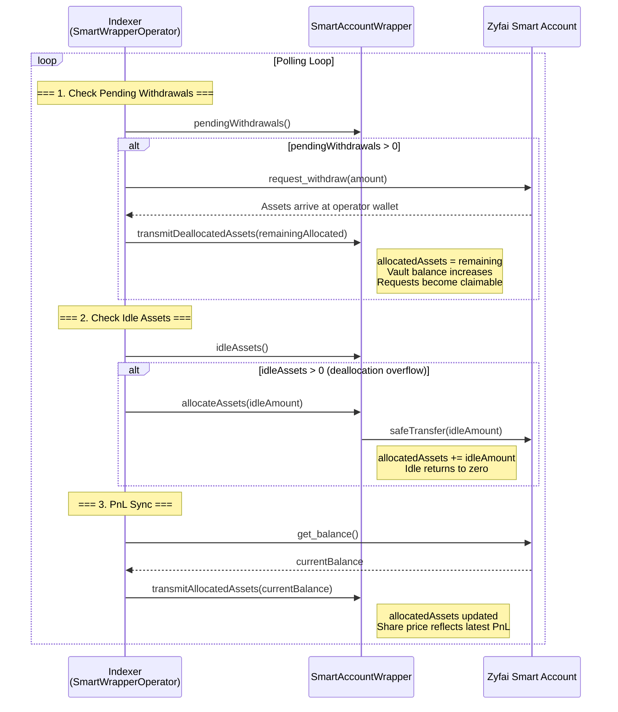
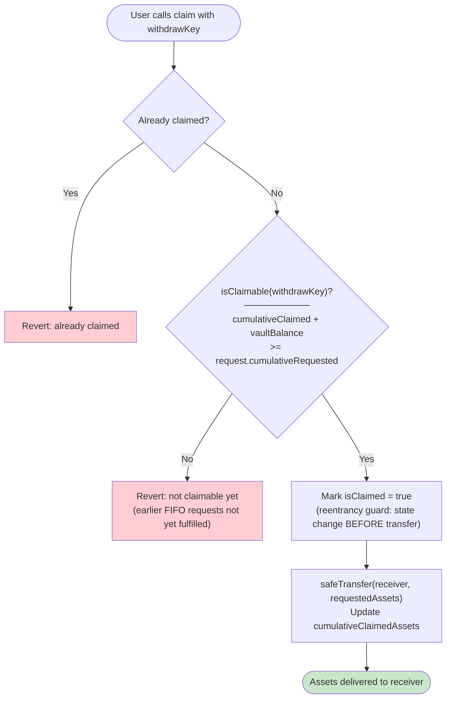
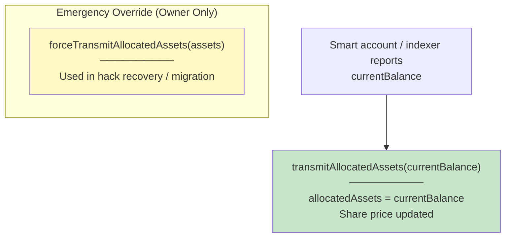
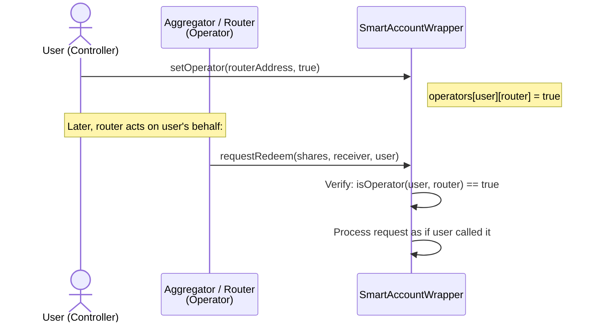
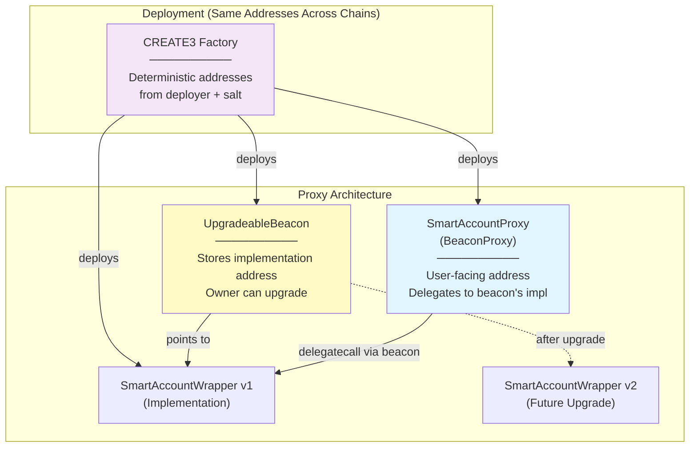

# Semi-Async Vault — Architecture Documentation

> **Audience**: Security auditors and integrators.
> This document describes the high-level design, trust model, and operational flows of the Semi-Async Vault system. It is not a line-by-line code walkthrough.

---

## Table of Contents

1. [System Overview](#1-system-overview)
2. [Roles & Trust Model](#2-roles--trust-model)
3. [Asset States](#3-asset-states)
4. [Deposit Flow](#4-deposit-flow)
5. [Withdrawal Flow](#5-withdrawal-flow)
6. [Indexer Loop](#6-indexer-loop)
7. [Claim Flow](#7-claim-flow)
8. [PnL Synchronization](#8-pnl-synchronization)
9. [ERC-7540 Operator System](#9-erc-7540-operator-system)
10. [Upgrade & Deployment Architecture](#10-upgrade--deployment-architecture)
11. [Key Invariants](#11-key-invariants)
12. [Known Tradeoffs & Assumptions](#12-known-tradeoffs--assumptions)
13. [Contract Reference](#13-contract-reference)

---

## 1. System Overview

The Semi-Async Vault is an **ERC-7540 compliant async redemption vault** that wraps a Zyfai smart account. It allows users to deposit ERC-20 tokens (one token per vault deployment) and earn yield generated by multiple DeFi strategies executed inside the Zyfai smart account.

**Key properties:**

- Deposits are **synchronous** — assets are immediately forwarded to the Zyfai smart account.
- Withdrawals are **asynchronous** — queued for async fulfillment.
- The vault is the **sole owner** of the Zyfai smart account, giving it full custody of allocated assets.
- A **centralized indexer** manages withdrawal fulfillment, idle asset allocation, and PnL synchronization.
- The vault is **ERC-4626 backward compatible** for standard integrations.



---

## 2. Roles & Trust Model



**Trust assumptions:**

- **Owner** is a Gnosis Safe multisig. It has full control: can upgrade the vault and reallocate assets. There is **no timelock** on upgrades — the multisig threshold is the sole protection. Users accept this as part of the trust model.
- **Smart Account** can update `allocatedAssets` via `transmitAllocatedAssets()`.
- **Indexer** is a centralized service. It is the sole mechanism for fulfilling async withdrawals and syncing NAV.
- **Users** interact permissionlessly. They can deposit, request withdrawals, and claim fulfilled requests.
- **ERC-7540 Operators** are approved per-controller for composability (e.g., aggregators, routers acting on behalf of depositors).

---

## 3. Asset States

The vault tracks assets in distinct states with a critical mutual exclusivity invariant:



**`totalAssets()` = idle + allocated**
_(pending withdrawals are subtracted because those shares are already burned)_

**How idle assets arise:** Idle only accumulates when the indexer deallocates more assets from the smart account than the current pending withdrawal obligations (deallocation overflow). Under normal operation, 100% of deposited assets are immediately allocated to the smart account — there is no configurable reserve buffer.

---

## 4. Deposit Flow

Deposits are fully synchronous. The user calls `deposit()` directly on the vault contract. Inside the deposit transaction, `transmitAllocatedAssets()` is called to sync the current NAV before minting shares. After the deposit, the Zyfai smart account asynchronously detects the incoming assets and incorporates them into its active strategies.



**Key details:**

- 100% of deposited assets are transferred to the smart account immediately — nothing remains idle.
- Share minting follows the standard ERC-4626 exchange rate formula.
- NAV is synced within the deposit call itself, ensuring the user receives shares at a fair price.

---

## 5. Withdrawal Flow

Withdrawals follow a hybrid model: immediate if idle liquidity is sufficient, otherwise queued for async fulfillment.



**Key details:**

- Since 100% of assets are allocated, **most withdrawals go through the async path**.
- Users can have **multiple pending requests** simultaneously (each gets a unique `withdrawKey` via incrementing nonce).
- Shares are **burned at request time**, not at claim time. This locks in the exchange rate.
- The `withdrawKey` is computed as `keccak256(abi.encode(vault, owner, nonce))`.

---

## 6. Indexer Loop

The centralized indexer runs a continuous polling loop that manages three responsibilities:



**Withdrawal fulfillment latency** depends on how quickly the smart account can unwind strategy positions. There is **no timeout or emergency withdrawal path** — if the indexer goes offline, users must wait for it to resume.

---

## 7. Claim Flow

After the indexer fulfills withdrawal requests, users must claim their assets. Claims follow **strict FIFO ordering**.



**FIFO enforcement:** A request is only claimable when all **prior** requests (by cumulative index) can also be satisfied. This means:

- Request #1 must be claimable before request #2.
- A large whale request can block smaller requests behind it until fully funded.
- This is an accepted tradeoff — there is no max request size or fairness splitting.

---

## 8. PnL Synchronization

The vault does not directly observe yield accrual. Instead, the smart account reports its current balance, and the vault updates `allocatedAssets` accordingly.



**Important constraint:** `transmitAllocatedAssets()` **cannot** be called while there are pending withdrawals (`pendingWithdrawals > 0`). This prevents share price manipulation during the withdrawal settlement window.

---

## 9. ERC-7540 Operator System

The vault implements the ERC-7540 operator standard for composability. Operators are third-party smart contracts (aggregators, routers, yield optimizers) that can act on behalf of a user (controller).



**Key details:**

- Operators are approved **per-controller** — approving an operator for your address does not affect other users.
- Operators can call `requestRedeem()` and `requestWithdraw()` on behalf of controllers.
- This enables other protocols to build on top of the vault without requiring users to move assets through intermediate contracts.

---

## 10. Upgrade & Deployment Architecture

### Proxy Pattern

The vault uses OpenZeppelin's **Beacon Proxy** pattern with **CREATE3** for deterministic cross-chain addresses.



### Upgrade Process

1. Deploy new `SmartAccountWrapper` implementation contract.
2. Owner (Safe multisig) calls `UpgradeableBeacon.upgradeTo(newImpl)`.
3. All proxies instantly route to the new implementation.
4. Optionally call `reinitialize()` if new storage variables are introduced.

**No timelock exists** on the upgrade path. The multisig threshold is the sole protection against malicious upgrades. This is an accepted trust assumption.

### Storage Layout

Both contracts use **ERC-7201 namespaced storage** to prevent storage collisions during upgrades:

- `SmartAccountWrapper` storage at slot `0x0b4df025...`
- `SemiAsyncRedeemVault` storage at slot `0x642da267...`

### ERC-1271 Signature Validation

The vault implements ERC-1271 because it is the **sole owner of the Zyfai smart account**. When the smart account (or protocols it interacts with) need to verify the vault's authorization, they call `isValidSignature()` on the vault, which delegates to the vault's owner (Safe multisig) for signature validation.

---

## 11. Key Invariants

1. **Mutual Exclusivity**: `idleAssets > 0` and `pendingWithdrawals > 0` can **never** both be true simultaneously.

2. **Accounting Identity**: `totalAssets() = vaultBalance + allocatedAssets + claimableFromStrategies - (pendingWithdrawals - cumulativeClaimedAssets adjustment)`

3. **FIFO Claim Ordering**: `isClaimable(key)` requires `cumulativeClaimed + vaultBalance >= request.cumulativeRequestedAtTimeOfRequest`.

4. **Share Burn at Request**: Shares are burned when the withdrawal request is created, not when claimed. The exchange rate is locked at request time.

5. **No PnL Sync During Withdrawals**: `transmitAllocatedAssets()` reverts if `pendingWithdrawals > 0`, preventing share price manipulation during settlement.

---

## 12. Known Tradeoffs & Assumptions

| Tradeoff                         | Description                                                                                                                                         | Mitigation                                                                          |
| -------------------------------- | --------------------------------------------------------------------------------------------------------------------------------------------------- | ----------------------------------------------------------------------------------- |
| **Indexer liveness dependency**  | If the indexer goes offline, no withdrawals can be fulfilled and no PnL syncs occur. There is no timeout or emergency withdrawal path for users.    | Indexer is monitored. Owner multisig can intervene via `forceTransmit*` functions.  |
| **No withdrawal reserve**        | 100% of deposits are allocated. Every withdrawal goes through the async queue unless deallocation overflow created idle assets.                     | Reduces capital inefficiency. Indexer fulfillment is expected to be reasonably fast. |
| **FIFO whale blocking**          | A large withdrawal request blocks all subsequent requests until fully funded. No max request size exists.                                           | Accepted tradeoff. Indexer can deallocate large amounts in a single operation.      |
| **Centralized NAV updates**      | Share price only updates when `transmitAllocatedAssets()` is called. Between calls, the NAV is stale.                                              | NAV is synced within deposit calls and by the indexer on each interaction.           |
| **Upgradeable without timelock** | Owner multisig can upgrade the vault implementation instantly with no delay.                                                                        | Trust in multisig signers. Users must evaluate multisig configuration.              |
| **Opaque strategy risk**         | Strategy composition is not enforced on-chain. Users trust the operator to manage risk appropriately.                                               | Off-chain reporting provides transparency.                                          |

---

## 13. Contract Reference

### Events

```
OperatorSet(controller, operator, approved)     — ERC-7540 operator approval
RedeemRequest(controller, owner, requestId, sender, assets)  — Async withdrawal requested
Claimed(receiver, owner, withdrawKey, assets)   — Withdrawal claimed
AllocatedAssetsTransmitted(newAllocatedAssets)  — PnL synced
DeallocatedAssetsTransmitted(remainingAllocated) — Withdrawal fulfilled
AssetsAllocated(assets)                          — Idle deployed to smart account
SmartAccountSet(smartAccount)                    — Smart account address changed
```

### Errors

```
SA__NotSmartAccount()             — Caller is not the registered smart account
SA__SmartAccountNotSet()          — Smart account not initialized
SA__NotEnoughIdleAssets()          — Trying to allocate more than idle balance
SA__PendingWithdrawals()           — PnL sync blocked during pending withdrawals
SA__NotClaimable()                 — FIFO: earlier requests not yet fulfilled
SA__NotAuthorized()                — Not controller or approved operator
```

### WithdrawRequest Structure

```solidity
struct WithdrawRequest {
    uint256 requestedAssets;                      // Amount requested
    uint256 cumulativeRequestedWithdrawalAssets;  // Cumulative at time of request (FIFO index)
    uint256 requestTimestamp;                      // Block timestamp
    address owner;                                 // Share owner who requested
    address receiver;                              // Asset recipient
    bool isClaimed;                                // Claim flag (reentrancy guard)
    uint256 requestedShares;                       // Shares burned (ERC-7540)
    address controller;                            // Operator controller (ERC-7540)
}
```
